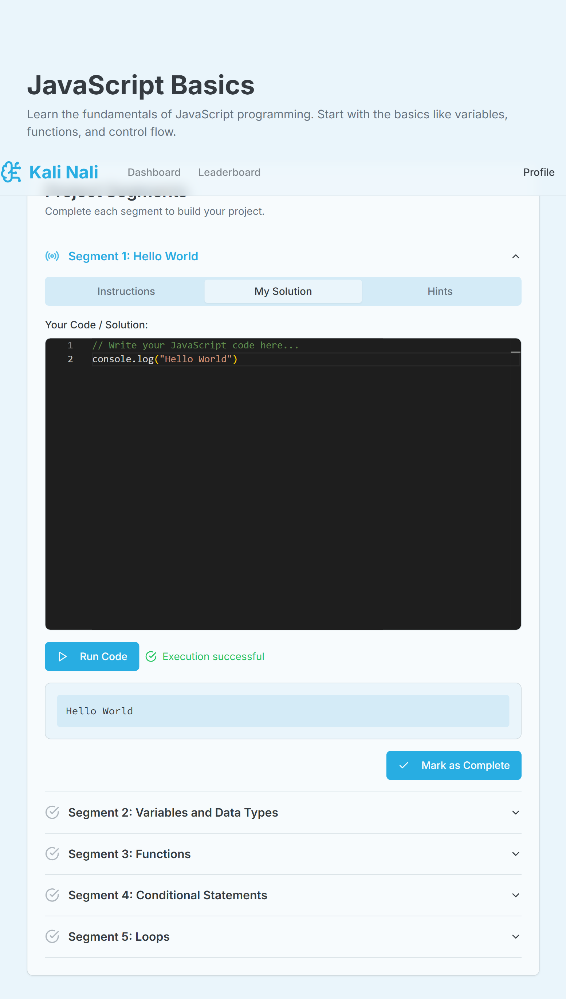

# Learn & Play

A digital learning environment where play becomes the primary engine of understanding.

## Prerequisites

- Node.js 18+ and npm/yarn/pnpm
- Google AI API key (for Genkit AI features)

## Setup

1. **Install dependencies:**
   ```bash
   npm install
   # or
   yarn install
   # or
   pnpm install
   ```

2. **Set up environment variables:**
   ```bash
   cp .env.example .env
   ```
   
   Then edit `.env` and add:
   - Your Google AI API key: `GOOGLE_GENAI_API_KEY=your_actual_api_key_here`
   - Generate a NextAuth secret: `NEXTAUTH_SECRET=$(openssl rand -base64 32)`
   - Set the NextAuth URL: `NEXTAUTH_URL=http://localhost:3000`

3. **Run the development server:**
   ```bash
   npm run dev
   # or
   yarn dev
   # or
   pnpm dev
   ```

4. **Open your browser:**
   Navigate to [http://localhost:3000](http://localhost:3000)
   
   You'll be redirected to the sign-in page. Use the demo account:
   - Email: `demo@example.com`
   - Password: `demo123`
   
   Or create a new account using the sign-up option.

## Available Scripts

- `npm run dev` - Start the Next.js development server
- `npm run build` - Build the production application
- `npm run start` - Start the production server (after building)
- `npm run lint` - Run ESLint
- `npm run genkit` - Start the Genkit development server (for AI flows)

## Project Structure

- `app/` - Next.js app router pages and layouts
- `components/` - React components (UI, dashboard, project, profile)
- `lib/` - Utilities, types, and data
- `ai/` - Genkit AI flows and configuration
- `hooks/` - Custom React hooks

## Authentication

The app uses NextAuth.js for authentication with email/password credentials. All routes are protected by default except the authentication pages (`/auth/signin`).

- **Sign In/Sign Up:** Available at `/auth/signin`
- **Protected Routes:** All pages require authentication
- **User Management:** In-memory storage (replace with database in production)

## Tech Stack

- **Framework:** Next.js 14 (App Router)
- **Language:** TypeScript
- **Styling:** Tailwind CSS
- **UI Components:** Radix UI + shadcn/ui
- **AI:** Genkit with Google AI (Gemini)
- **Authentication:** NextAuth.js
- **State Management:** React Context API


